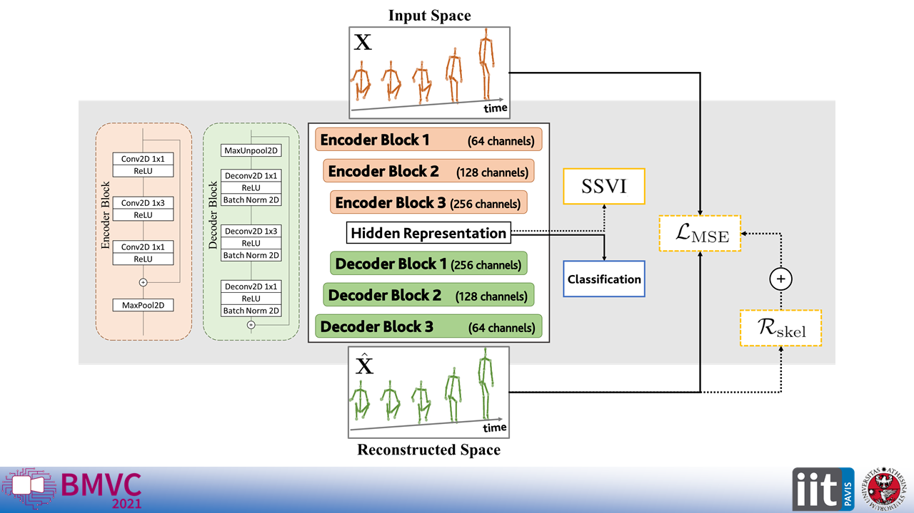

# Unsupervised Human Action Recognition with Skeletal Graph Laplacian and Self-Supervised Viewpoints Invariance



This repository provides the Pytorch code for our work accepted to [BMVC 2021](https://www.bmvc2021.com/) as an Oral Presentation.

Code repository with training script for the NTU-60 and NTU-120 datasets.

## Requirements
+ Numpy
+ Scikit-learn
+ Pytorch
+ Tqdm
+ [Wandb](https://wandb.ai/site)

The code has been run on PyTorch version 1.6.0, and we therefore recommend this version.

For any questions, feel free to contact giancarlo.paoletti@iit.it

## Dataset preprocessing
+ NTU-60
    + Download zip file containing raw skeleton data [here](https://drive.google.com/open?id=1CUZnBtYwifVXS21yVg62T-vrPVayso5H)
    + Extract the nturgb+d_skeletons folder, contained inside zip file, to "dataset/raw/ntu_60"
    + Execute [NTU60_dataset_preprocessing.py](https://github.com/IIT-PAVIS/UHAR_Skeletal_Laplacian/blob/main/dataset/NTU60_dataset_preprocessing.py)


+ NTU-120
    + Download zip files containing raw skeleton data [here](https://drive.google.com/open?id=1CUZnBtYwifVXS21yVg62T-vrPVayso5H) and [here](https://drive.google.com/open?id=1tEbuaEqMxAV7dNc4fqu1O4M7mC6CJ50w)
    + Extract the nturgb+d_skeletons folders, contained inside zip files, to "dataset/raw/ntu_120"
    + Execute [NTU120_dataset_preprocessing.py](https://github.com/IIT-PAVIS/UHAR_Skeletal_Laplacian/blob/main/dataset/NTU120_dataset_preprocessing.py)
    
## Citation
 ```
@inproceedings{UHAR_BMVC2021,
    title={{Unsupervised Human Action Recognition with Skeletal Graph Laplacian and Self-Supervised Viewpoints Invariance}},
    author={Paoletti, Giancarlo and Cavazza, Jacopo and Beyan, Cigdem and Del Bue, Alessio},
    booktitle={The 32nd British Machine Vision Conference (BMVC)},
    year={2021},
}
 ```

## Disclaimer
The software is provided "as is", without warranty of any kind, express or implied, including but not limited to the warranties of merchantability, fitness for a particular purpose and noninfringement. In no event shall the authors, PAVIS or IIT be liable for any claim, damages or other liability, whether in an action of contract, tort or otherwise, arising from, out of or in connection with the software or the use or other dealings in the software.

## LICENSE
This project is licensed under the terms of the MIT license.


